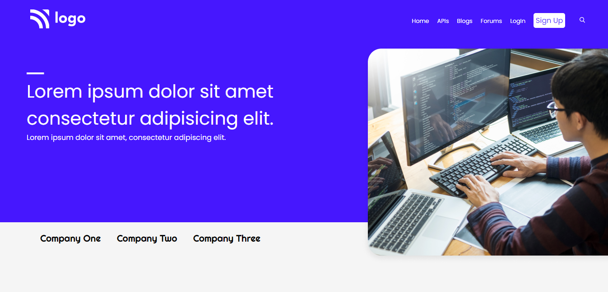
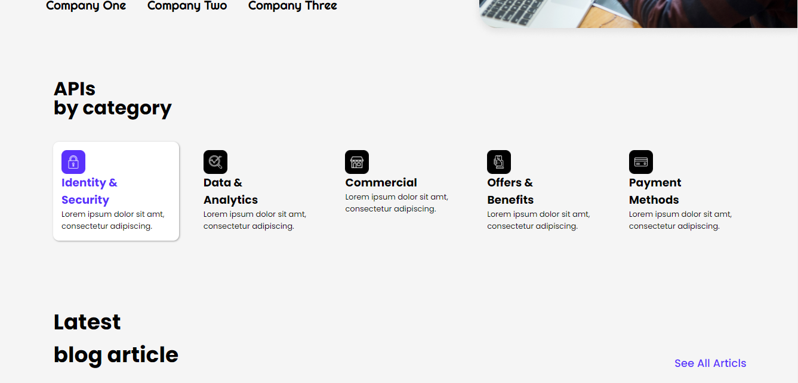
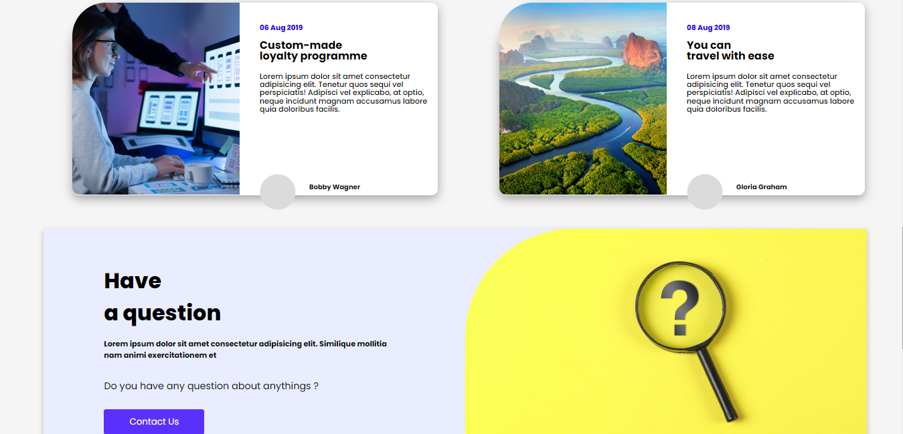

# Project-9:  **Web Solutions**
# Technology Used :  

##  **About** :- 
In this Project, i have used HTML and CSS to create a ***Web Solutions*** website's Landing page.  
As a beginner project, i have lerned lots of new CSS  concepts like- position display-properties, Flex-Box and Border-radius. Also started using CSS Globally without crowding HTML code. 

## [***Project-live-Link-->***]() 

##  **Website Preview-->**

## Thank you for visiting.. also ckeck-out my next Projects & please share your valuable Feedback 👍👍    
